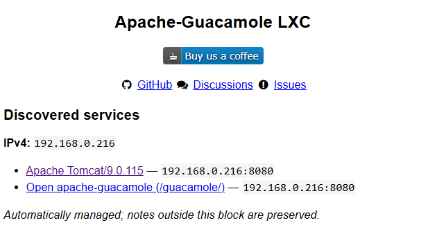

# PVE Service Discovery

PVE Service Discovery makes each local Proxmox LXC announce its web interface in
the container's own **Notes** panel.

It runs on the Proxmox host, asks running containers for their IPv4 addresses and
listening TCP ports, checks those ports for HTTP/HTTPS, and writes a managed block
like this:

```markdown
### Discovered services

**IPv4:** `192.168.1.87`

- [Beszel](http://192.168.1.87:8090/) — `192.168.1.87:8090`

_Automatically managed; notes outside this block are preserved._
```

No agent, database, Docker container, browser extension, or external service is
required. It uses the `pct` and `pvesh` tools already present on Proxmox VE.



PVE Service Discovery is an independent community project and is not affiliated
with or endorsed by Proxmox Server Solutions GmbH.

## Safety model

- It owns only the text between two HTML comment markers.
- Notes outside those markers are preserved byte-for-byte.
- Missing or duplicated markers cause that CT to be skipped with an error.
- Proxmox's configuration digest is supplied when writing, so a concurrent edit
  causes the update to fail instead of silently overwriting it.
- It does not modify container networking, packages, services, tags, or firewalls.
- Probes stay on networks reachable from the Proxmox node and read at most 64 KiB.
- A process lock prevents overlapping manual and timer runs.

## Requirements

- Proxmox VE 8 or 9
- Python 3
- Root access on the Proxmox node
- `ip` and preferably `ss` inside each LXC (normal Debian/Ubuntu containers have
  them; `/proc/net/tcp` and `hostname -I` are fallback paths)

The current release discovers local **LXCs and IPv4 only**. For a Proxmox cluster,
install it on each node; every copy handles only the containers local to that node.

## Install

Download the current source on the Proxmox host:

```bash
curl -fsSL https://github.com/pcbjunkie/pve-service-discovery/archive/refs/heads/main.tar.gz \
  | tar -xz
cd pve-service-discovery-main
./install.sh
```

Or copy/extract a release archive, enter its directory, and run:

```bash
./install.sh
```

The installer adds a systemd timer but deliberately does not perform an immediate
write. Preview what the first scan will do:

```bash
pve-service-discovery --dry-run
```

Then either wait about two minutes for the timer or run it immediately:

```bash
systemctl start pve-service-discovery.service
```

Useful checks:

```bash
systemctl status pve-service-discovery.timer
systemctl list-timers pve-service-discovery.timer
journalctl -u pve-service-discovery.service
```

To preview or scan one container:

```bash
pve-service-discovery --dry-run --vmid 105 --verbose
pve-service-discovery --vmid 105
```

## Configuration

The installed configuration is `/etc/pve-service-discovery.ini`. Defaults are
usable as-is. The installer never overwrites an existing configuration file.

Global settings live under `[discovery]`. Per-container sections are optional:

```ini
[container:105]
enabled = true
addresses = 192.168.1.87
include_ports = 8090
ignore_ports = 1234
label.8090 = Beszel
path.8090 = /
scheme.8090 = http
```

Overrides are useful when an app listens on a port that `ss` cannot report, uses a
non-root path, has an unhelpful HTML title, or needs a forced scheme.

To exclude a CT without changing or removing its current managed block:

```ini
[container:109]
enabled = false
```

After changing the configuration, simply run the service again. No daemon needs
restarting.

## What gets probed

The script starts with every listening TCP port reported by the container. Common
non-web protocols—SSH, DNS, SMTP, SMB, databases, RDP, VNC, and similar ports—are
excluded by default. It sends one short `GET /` request to the remaining ports,
tries HTTPS when appropriate, accepts self-signed certificates for discovery, and
inspects at most one same-origin redirect while locating the application page.

If the root URL is only a 404 or generic web-server page, discovery also tests a
small number of paths derived from the container name. For example, a container
named `apache-guacamole` causes `/guacamole/` to be tested. Distinct successful
paths are listed alongside a working root URL; identical catch-all responses are
deduplicated. A dead root page is omitted when a working nested application is
found. Same-origin redirects are also inspected. This keeps nested applications
clickable without maintaining a hard-coded app database or guessing which valid
link the user wanted.

Edit `ignored_ports` if your environment has another service that should never
receive an HTTP probe. `include_ports` can add a port manually.

## Remove

Keep the generated Notes blocks:

```bash
./uninstall.sh
```

Remove the generated blocks first:

```bash
./uninstall.sh --remove-notes
```

The configuration file is intentionally retained in both cases.

## Development checks

Run from the project directory:

```bash
python3 -m unittest discover -s tests -v
python3 -m py_compile pve_service_discovery.py
bash -n install.sh uninstall.sh
```

## License

MIT

Created and tested by [pcbjunkie](https://github.com/pcbjunkie), with
implementation assistance from OpenAI Codex.
